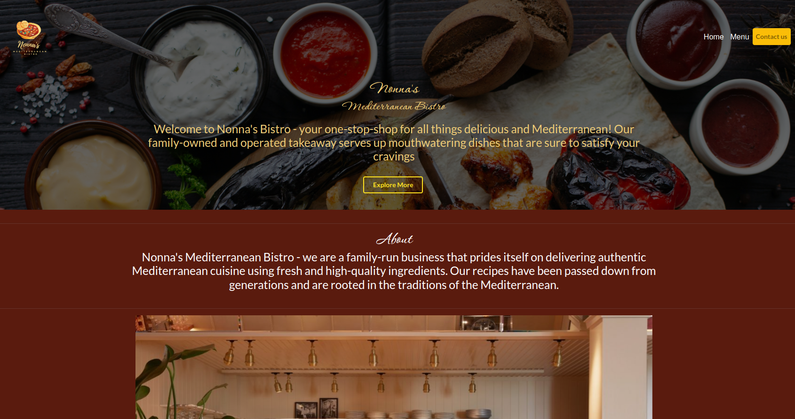
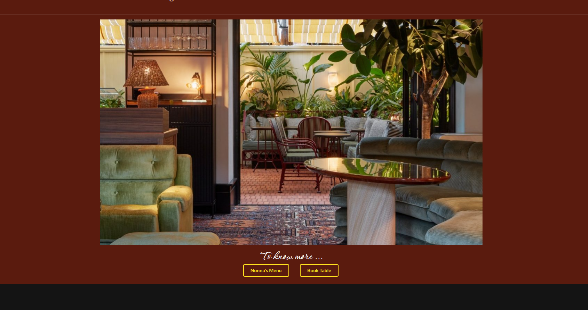
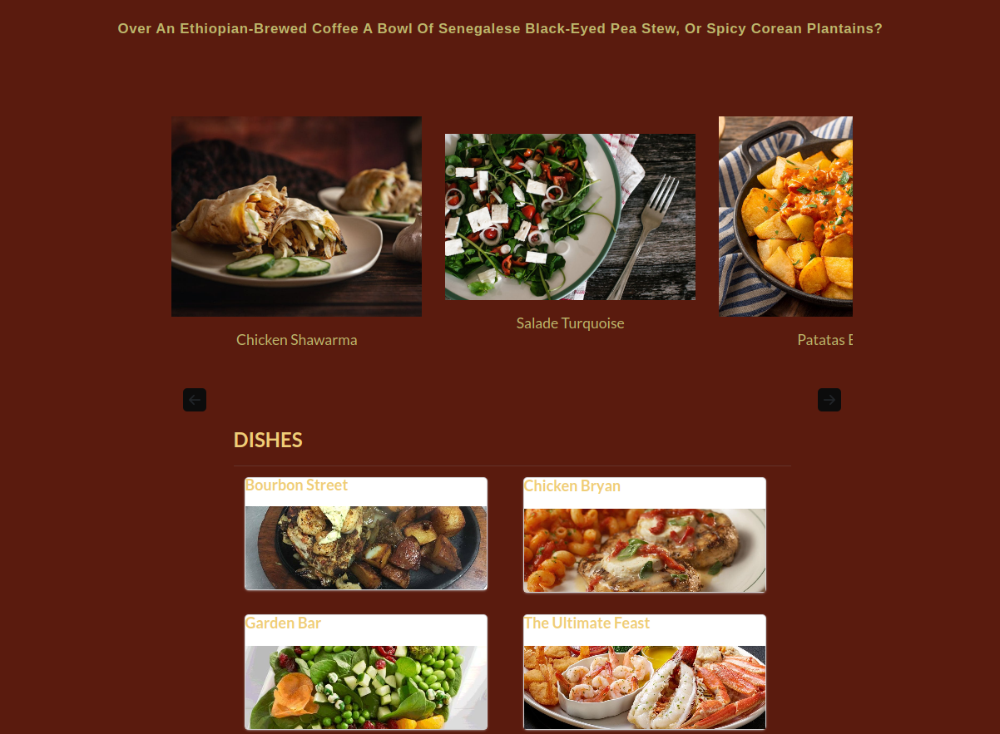
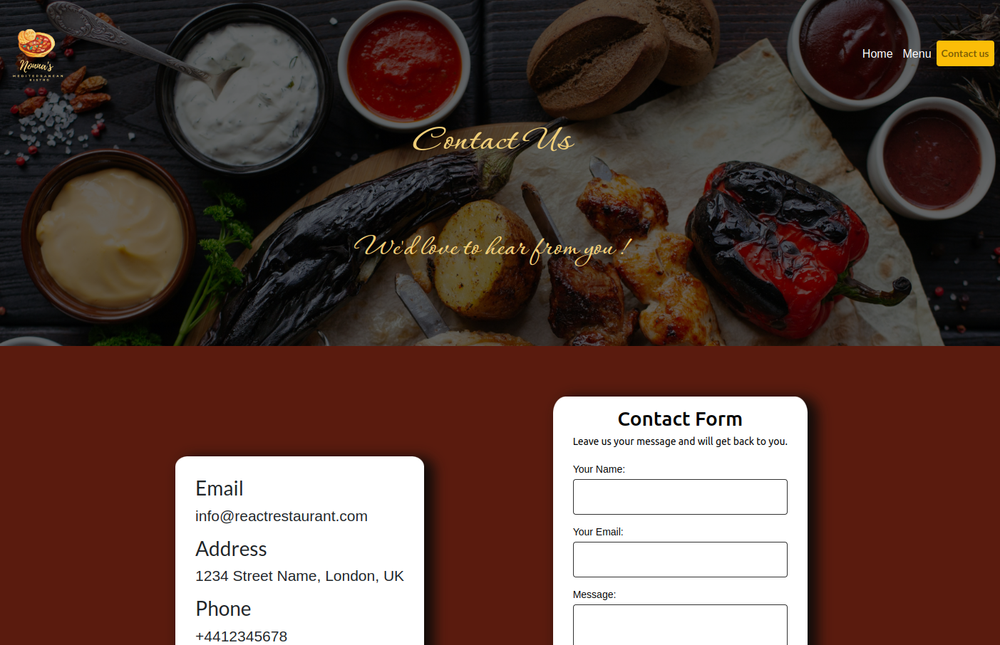
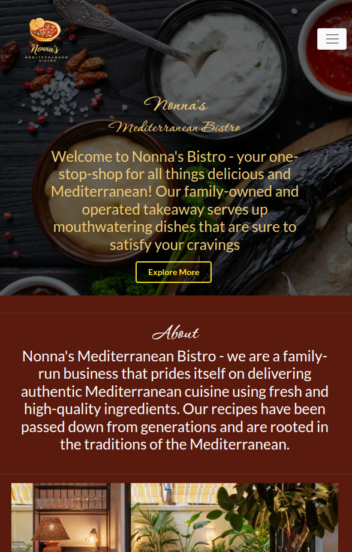
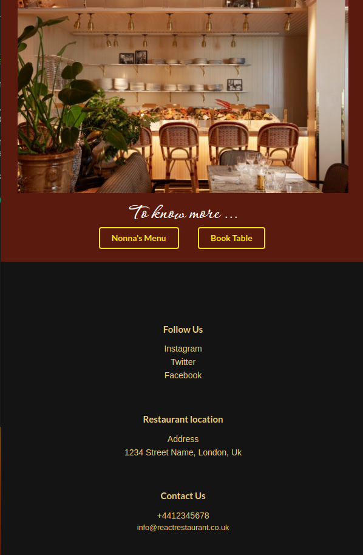
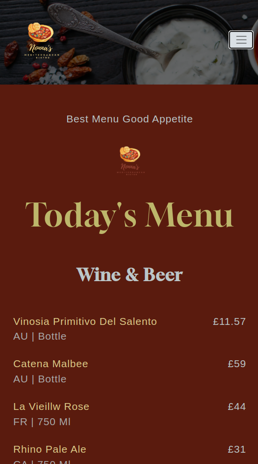
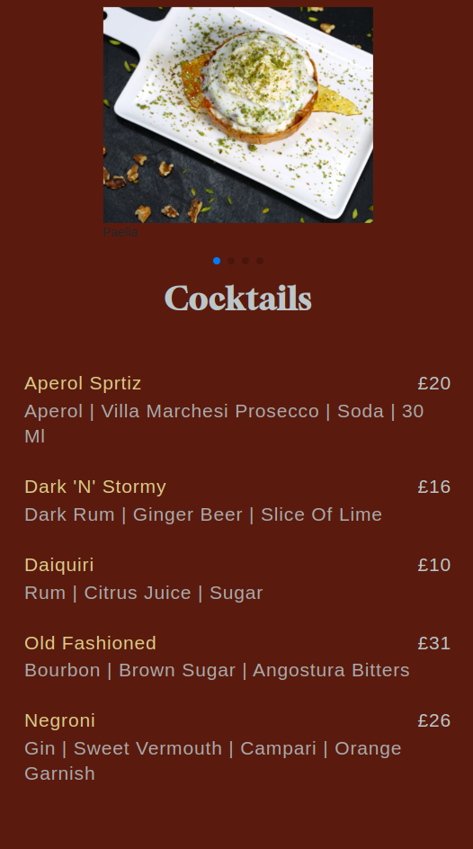
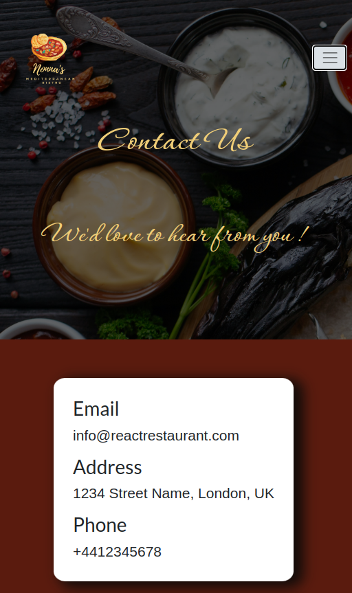
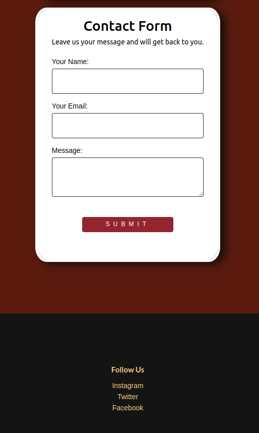

# React Restaurant Application

## Description

Web application for a restaurant, it provides a way for customers of Nonna's to view dishes and menus from the restaurant and allow users to contact and book a table.

## Table of contents
- [React Restaurant Application](#react-restaurant-application)
  - [Description](#description)
  - [Table of contents](#table-of-contents)
  - [Application requirments](#application-requirments)
  - [User Story](#user-story)
  - [Technologies Used](#technologies-used)
  - [New Libraries not used before](#new-libraries-not-used-before)
  - [Installation](#installation)
  - [Usage](#usage)
  - [Screenshots](#screenshots)
  - [Repository and Deployed](#repository-and-deployed)
  - [Credits](#credits)
  - [License](#license)
## Application requirments

* Must use ReactJS.

* Must use Node.

* Must have both GET and POST routes for retrieving and adding new data.

* Must deploy this application using Netlify.

* Must utilize at least two libraries, packages, or technologies that we haven't discussed.

* Must have a polished front end/UI.

* Must meet good quality coding standards (indentation, scoping, naming).

* Have a quality README (with unique name, description, technologies used, screenshot, and link to deployed application).

## User Story

As a restaurant ownwer i want my customers to be able to find the business online, be able to view the restaurant menu icluding pictures of the dishes with prices and contact the restaurant.


## Technologies Used

The main technolgies we have used are React.js, Bootstrap, Semantic UI, html and css.

## New Libraries not used before

The two additional libraries we used that we haven't covered before are 

- Semantic UI
- Netlify Forms

## Installation 

Run the script below to install the app.
```
  npm i --legacy-peer-deps
```

## Usage

Open terminal and run the following to run the app.
```
  npm start
```

## Screenshots

Desktop:









Mobile:














## Repository and Deployed

For any questions or requests : [https://github.com/QuantumK9/react-restaurant](https://https://github.com/QuantumK9/react-restaurant).

Deployed website:

[https://astonishing-tanuki-13cbcf.netlify.app/](https://astonishing-tanuki-13cbcf.netlify.app/).

## Credits

Adama, Crystal, Iraklis, Ricky


## License 

MIT License

[](https://opensource.org/licenses/MIT)
  


